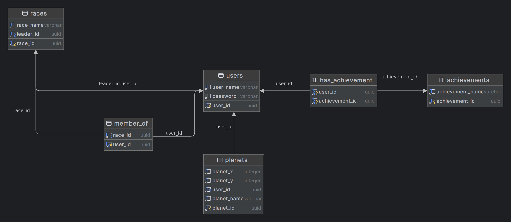
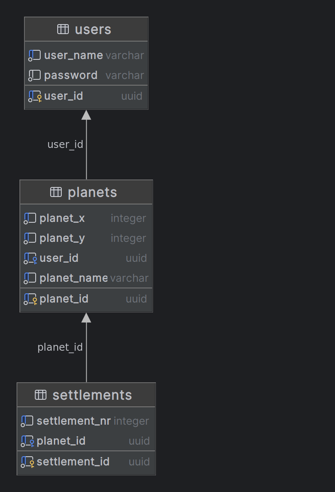
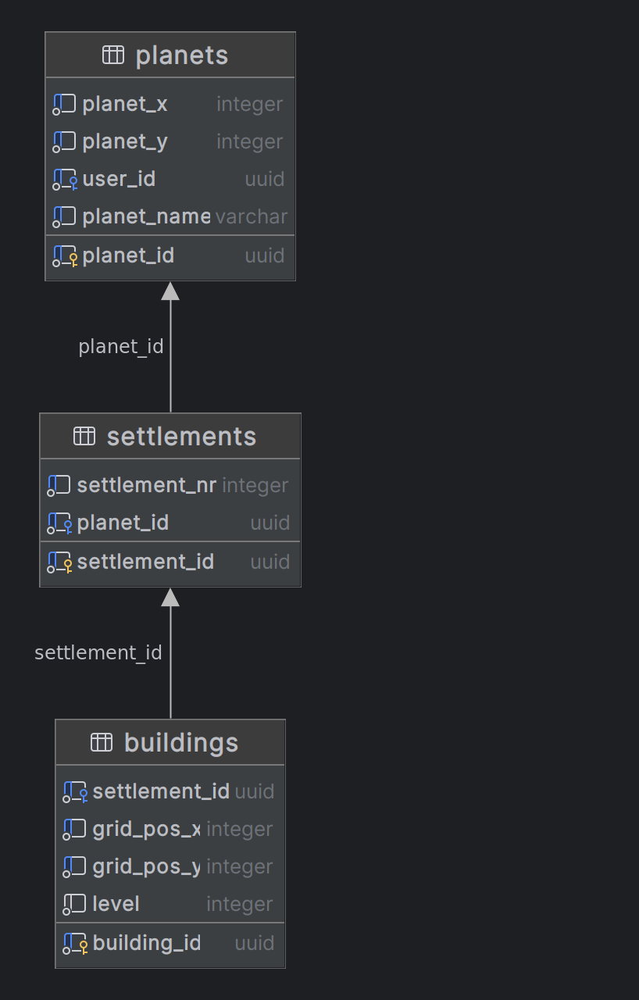
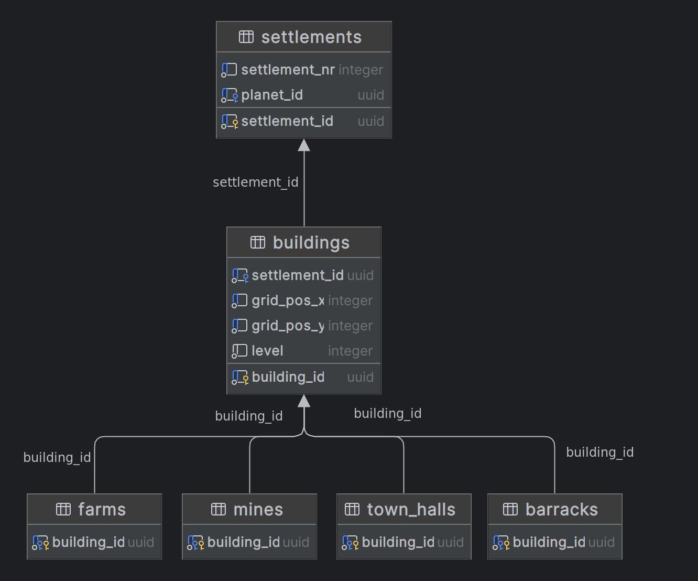
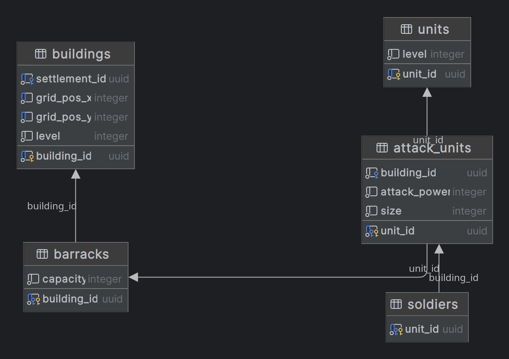

# ER-Model explanation:

Every step in the diagram will be explained:

## Users:

Every user is defined by:
- Username: this is always unique
- Password: this has at least one capital letter and one number
- User-id: this is a UUID (Universally Unique Identifier) which is a 128-bit number that
is visualised using 32 Hexadecimal numbers and 4 lines "-".
  We are using UUID1, which generates this huge number 
based on the date and time of registration (accurate to the nanosecond) + an element of the host-address,
  so this number is 
guaranteed to be unique.
  This is the **primary key** of the class.

### Achievements:
A user can have multiple achievements, and an achievement has multiple users that gained this 
achievement. An achievement is for now defined by an achievement-name that is unique and an achievement-id (UUID), which is
its primary key. 

This makes the relation between achievements and users to be in the form of an extra table `has_achievement` that uses 
both of its entries (user-id and achievement-id) it's primary keys.

### Races:
Races are the sort of alliances that are used in this game.
A race has a race-leader, which is a User.
A Race also has multiple members, these members are also users.
The primary key of a race is its unique race-id
that again is a UUID.
For the leader, we can just include him in the Race table.
For members, we make an extra relationship `member_of`
where the user is its primary key (a user can only have one race) and the second element is the `race_id`.

## Planets:

Planets have as primary key a `planet_id` which is again a UUID.
It also has a unique combination of x- and y-value, so its  
position is strictly unique on the map.
It can have an owner which is ofcourse a User with a `user_id`.
A planet also has a name, which the player that owns it can choose, otherwise this will just a random name + a number.

## Settlements:

A settlement's primary key is its `settlement_id`.
It als has a `settlement_nr` to indicate which settlement on the planet it is and 
ofcourse it has a `planet_id` of the planet it is on.

## Buildings:

Buildings have a unique `settlement_id` of the settlement they are in. They also have a unique grid position inside this
settlement which is displayed with `grid_pos_x` and `grid_pos_y`. A building also has a `level` and a `building_id` which is its primary key.
For now there are multiple buildings types like `farms`, `mines`, `town_halls` and `barracks`.

## Barracks:

A barack is a subclass of a building.
This means it has as primary key a `building_id`.
A barrack can hold multiple soldiers.
### Soldiers:
A soldier is a subclass of an `attack_unit` which has `attack_power`,
a `unit_id` (primary key),
a size (how much space the unit takes up) and a `building_id` of which barrack the unit is staying in.

A soldier by itself is used to automatically set a lot of the values of the attack_unit part of the unit.
For example,
the size and attack_power are added by simply adding a soldier item.
